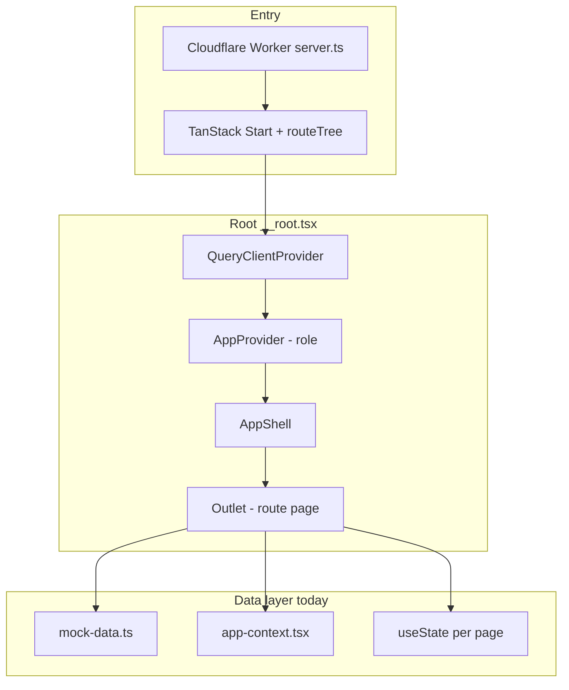

# Mercado CRM — Architecture Documentation

**Project:** `mercado-crm` (package name: `tanstack_start_ts`)
**Product UI:** Quant Capital — Wealth CRM
**Template:** Lovable `tanstack_start_ts_2026-05-12`
**Analysis date:** 2026-05-26
**Scope:** Read-only audit of the workspace; no application code was modified during analysis.

---

## 1. Tech Stack & Configuration

### Runtime & Framework

| Layer | Technology | Version (approx.) | Role |
|--------|------------|-------------------|------|
| Build | **Vite** | 7.3.x | Dev server, bundling |
| UI | **React** | 19.2.x | Components |
| Meta-framework | **TanStack Start** | 1.167.x | SSR, file routing, server entry |
| Routing | **TanStack Router** | 1.168.x | File-based routes, type-safe navigation |
| Data fetching (wired, lightly used) | **TanStack React Query** | 5.83.x | `QueryClient` in router context |
| Styling | **Tailwind CSS** v4 | 4.2.x | Utility classes, `@theme` tokens |
| UI primitives | **shadcn/ui** (Radix) | — | `src/components/ui/*` |
| Icons | **lucide-react** | 0.575.x | Navigation, metrics, modals |
| Forms (available) | **react-hook-form**, **zod**, **@hookform/resolvers** | — | Used in Users "Add Agent" form |
| Charts (available) | **recharts** | 2.15.x | `chart.tsx` present; not used in routes yet |
| Toasts | **sonner** | 2.0.x | Call/message/agent actions |
| Deployment target | **Cloudflare Workers** | — | `@cloudflare/vite-plugin`, `wrangler.jsonc` |

### Not present in this repo

- **No Supabase** (no auth/DB client)
- **No Redux/Zustand** — state is React Context + local `useState`
- **No `pages/` directory** — screens live under `src/routes/` (TanStack file routing)
- **No custom REST/GraphQL backend** — all domain data is mocked in `src/lib/mock-data.ts`

### Configuration files

| File | Purpose |
|------|---------|
| `vite.config.ts` | Lovable `defineConfig` from `@lovable.dev/vite-tanstack-config`; sets `tanstackStart.server.entry = "server"` and dev `port: 3000` |
| `tsconfig.json` | Strict TS, path alias `@/*` → `./src/*` |
| `components.json` | shadcn: style `new-york`, aliases, Tailwind in `src/styles.css` |
| `wrangler.jsonc` | Cloudflare Worker entry: `src/server.ts` |
| `eslint.config.js` / `.prettierrc` | Lint/format |
| `pnpm-workspace.yaml` | Monorepo-style workspace marker (lockfile present) |

### Path alias

```json
"@/*": ["./src/*"]
```

### Dev server port

The dev server runs on **`http://localhost:3000/`**. The override lives in `vite.config.ts`:

```ts
export default defineConfig({
  tanstackStart: {
    server: { entry: "server" },
  },
  vite: {
    server: {
      port: 3000,
    },
  },
});
```

> The previous port (`8080`) was the implicit default from `@lovable.dev/vite-tanstack-config`. It was not defined anywhere in the repo.

### Design system

- Dark theme enforced at root (`<html className="dark">`, `AppShell` `dark` class)
- Custom OKLCH palette in `src/styles.css`: navy background, emerald success, financial accents (`--success`, `--warning`, `--info`, `--surface`, gradients)
- Animations: `animate-ticker`, `animate-fade-in-up`, `animate-pulse-dot` (Tailwind + `tw-animate-css`)

---

## 2. Folder Structure

There is **no `src/pages/`** folder. Route components are co-located in `src/routes/`.

```
mercado-crm/
├── public/                    # Static assets (logos)
├── src/
│   ├── router.tsx             # Router factory (QueryClient + routeTree)
│   ├── routeTree.gen.ts       # AUTO-GENERATED route tree (do not edit)
│   ├── start.ts               # TanStack Start instance + SSR error middleware
│   ├── server.ts              # Cloudflare Worker entry; SSR error normalization
│   ├── styles.css             # Tailwind v4 + theme tokens
│   │
│   ├── routes/                # File-based pages (TanStack Router)
│   │   ├── __root.tsx         # HTML shell, providers, AppShell layout
│   │   ├── index.tsx          # Dashboard (/)
│   │   ├── clients.index.tsx  # Clients list (/clients)
│   │   ├── clients.$id.tsx    # Client detail (/clients/:id)
│   │   ├── tasks.tsx          # Kanban tasks (/tasks)
│   │   └── users.tsx          # User management (/users)
│   │
│   ├── components/            # App-specific UI
│   │   ├── AppShell.tsx       # Layout: ticker + sidebar + topbar + main
│   │   ├── Sidebar.tsx
│   │   ├── Topbar.tsx
│   │   ├── MarketTicker.tsx
│   │   ├── MetricCard.tsx
│   │   ├── ClientCard.tsx
│   │   ├── CallModal.tsx
│   │   ├── MessageModal.tsx
│   │   └── ui/                # shadcn/Radix primitives (~40 components)
│   │
│   ├── lib/
│   │   ├── mock-data.ts       # Types + seed data + formatCurrency
│   │   ├── app-context.tsx    # Role switcher (Admin vs Agent)
│   │   ├── utils.ts           # cn() — clsx + tailwind-merge
│   │   ├── error-capture.ts   # Global error capture for SSR
│   │   └── error-page.ts      # Branded 500 HTML
│   │
│   └── hooks/
│       └── use-mobile.tsx     # 768px breakpoint (used by shadcn sidebar)
│
├── components.json            # shadcn config
├── package.json
├── vite.config.ts
└── wrangler.jsonc
```

### Folder purposes

| Folder | Purpose |
|--------|---------|
| `src/routes/` | **Pages** — each file exports `Route` via `createFileRoute` and a page component |
| `src/components/` | Reusable CRM UI (not route-bound) |
| `src/components/ui/` | Generic design-system components (shadcn) |
| `src/lib/` | Shared logic, mock data, context, SSR helpers |
| `src/hooks/` | Shared React hooks |

---

## 3. Routing Architecture

### How routing works

1. **File-based routing:** Files in `src/routes/` are scanned by `@tanstack/router-plugin`.
2. **`routeTree.gen.ts`** merges routes into `routeTree` (generated; do not hand-edit).
3. **`router.tsx`** creates the app router:

```ts
import { QueryClient } from "@tanstack/react-query";
import { createRouter } from "@tanstack/react-router";
import { routeTree } from "./routeTree.gen";

export const getRouter = () => {
  const queryClient = new QueryClient();

  const router = createRouter({
    routeTree,
    context: { queryClient },
    scrollRestoration: true,
    defaultPreloadStaleTime: 0,
  });

  return router;
};
```

4. **`__root.tsx`** wraps all routes: `QueryClientProvider` → `AppProvider` → `AppShell` → `<Outlet />`.

### Route table

| Path (URL) | Route file | Exported component | Notes |
|------------|------------|-------------------|--------|
| `/` | `routes/index.tsx` | `Dashboard` | Trading floor overview |
| `/clients` | `routes/clients.index.tsx` | `ClientsPage` | Full client table + filters |
| `/clients/:id` | `routes/clients.$id.tsx` | `ClientDetail` | Dynamic param `id` |
| `/tasks` | `routes/tasks.tsx` | `TasksPage` | 3-column kanban |
| `/users` | `routes/users.tsx` | `UsersPage` | Admin-only agent management |

**Navigation aliases (TanStack `to`):**

- List clients: `to: "/clients"` (maps to `clients.index.tsx`)
- Client detail: `to: "/clients/$id", params: { id }`

### Root layout & SSR

```tsx
function RootComponent() {
  const { queryClient } = Route.useRouteContext();
  return (
    <QueryClientProvider client={queryClient}>
      <AppProvider>
        <AppShell>
          <Outlet />
        </AppShell>
        <Toaster theme="dark" />
      </AppProvider>
    </QueryClientProvider>
  );
}
```

- Document title: **"Quant Capital — Wealth CRM"**
- SSR enabled (`Register { ssr: true }` in `routeTree.gen.ts`)
- Server pipeline: `start.ts` (middleware) → `server.ts` (Cloudflare `fetch`) → TanStack server entry

### Sidebar navigation (role-aware)

- **Base (all roles):** `/`, `/clients`, `/tasks`
- **Administrator only:** `/users` (User Management)
- Active state: exact match for `/`, `pathname.startsWith(to)` for others.

---

## 4. Core Pages & Components

### Layout shell

```
MarketTicker (top strip)
└── flex row
    ├── Sidebar (md+, 240px)
    └── column
        ├── Topbar (search, role switcher, notifications, user)
        └── <main>{route page}</main>
```

### Page summaries & mocked behavior

#### `/` — Dashboard (`Dashboard`)

**Data:** `clients` from `mock-data`, filtered by `useApp()` role.

| Behavior | Implementation |
|----------|----------------|
| Agent view | Shows only clients where `assignedAgent === currentUser.name` |
| Admin view | Shows all clients |
| Priority feed | First 6 filtered clients via `ClientCard` |
| KPI metrics | **Hardcoded strings** (AUM $128.4M, 47 leads, 68% win rate, 14 follow-ups) |
| Compliance panel | **Inline array** (KYC, risk profiles, reports, rebalancing counts) |
| Sector allocation | **Inline array** (Tech 32%, Financials 21%, etc.) |
| Portfolio banner | Static "+1.84% today" |
| Modals | `CallModal`, `MessageModal` on card actions |
| Navigation | "View all" → `/clients`; card open → `/clients/$id` |

#### `/clients` — Clients list (`ClientsPage`)

| Behavior | Implementation |
|----------|----------------|
| Data source | Full `clients` array |
| Search | `name` or `email` substring (case-insensitive) |
| Filters | Risk tier, portfolio bucket (`lt1m`, `1to5m`, `gt5m`), assigned agent |
| Table | Custom HTML `<table>`, row click → detail |
| Actions | Call/Message buttons (stop propagation); same modals as dashboard |
| Agent filter options | Derived via `useMemo` from unique `assignedAgent` values |

#### `/clients/:id` — Client detail (`ClientDetail`)

| Behavior | Implementation |
|----------|----------------|
| Lookup | `clients.find(c => c.id === id)` |
| Not found | Simple message + link back |
| Timeline | `timelineNotes.filter(n => n.clientId === client.id)` — **only populated for `c1` in mock data** |
| Assignment history | `assignmentHistory.filter(...)` — **only `c1`** |
| Funding progress | `(portfolioValue / targetInvestment) * 100` |
| Quick stats | **Hardcoded** (account opened, YTD +12.4%, risk 72, 34 holdings) |
| Actions | Call / Message modals (Spanish labels: Llamar, Escribir) |

#### `/tasks` — Tasks (`TasksPage`)

| Behavior | Implementation |
|----------|----------------|
| Seed data | `tasks` from `mock-data` copied into `useState` |
| Board | 3 columns: `todo`, `in_progress`, `done` |
| Move task | `move(id, dir)` shifts status along fixed order |
| New task button | **UI only** — no handler |
| Overdue styling | `due === "Overdue"` → destructive color |

#### `/users` — User management (`UsersPage`)

| Behavior | Implementation |
|----------|----------------|
| Access control | If `role !== "Administrator"` → lock screen + button to `/` |
| Agent list | `useState(agents)` seeded from mock; **can add agents** via dialog |
| Add agent | FormData → append to local state, `toast.success`, id `a${length+1}` |
| Edit permissions | Random initial checkboxes (`Math.random() > 0.3`); save → toast only |
| Permissions list | Static `permList` array (6 strings) |

### Shared components

| Component | Responsibility | Mock / local logic |
|-----------|----------------|-------------------|
| **AppShell** | Layout composition | None |
| **Sidebar** | Nav links + market status widget | Static "Open · NYSE", "Closes in 3h 47m" |
| **Topbar** | Global search (non-functional), role dropdown, bell, user avatar | `useApp()` role switch |
| **MarketTicker** | Scrolling indices/FX/crypto | `marketTicker` duplicated for infinite scroll |
| **MetricCard** | KPI card with icon, value, delta | Presentational only |
| **ClientCard** | Compact client row + progress bar + CTA | `formatCurrency`, progress calc |
| **CallModal** | Simulated call UI | Timer `setInterval` while open; mute toggle; summary textarea; "End & Save" → toast |
| **MessageModal** | Template picker + editable body | 4 templates (WhatsApp/Email); Send → toast |
| **ui/** | shadcn primitives | Used: Dialog, Button, Input, Select, Checkbox, Textarea, Dropdown, Sonner |

### Global app context (`useApp`)

| Field | Values | Effect |
|-------|--------|--------|
| `role` | `"Administrator"` \| `"Agent"` | Default: Administrator |
| `setRole` | toggles preview mode | Topbar dropdown |
| `currentUser` | Admin → Lucía Herrera; Agent → Carlos Mendoza | Dashboard filter, topbar display |

**No persistence** — role resets on full page reload.

---

## 5. Data Models

### TypeScript interfaces (`src/lib/mock-data.ts`)

```typescript
// Enums / unions
type Tier = "Conservative" | "Moderate" | "Aggressive"
type KycStatus = "Verified" | "Pending" | "Expired"

interface Client {
  id: string
  name: string
  email: string
  phone: string
  tier: Tier
  portfolioValue: number
  targetInvestment: number
  netWorthBracket: string
  kyc: KycStatus
  interests: string[]
  assignedAgent: string
  lastContact: string
  avatarColor: string
}

interface TimelineNote {
  id: string
  clientId: string
  agent: string
  type: "note" | "call" | "message" | "meeting"
  text: string
  date: string  // ISO string
}

interface AssignmentEvent {
  id: string
  clientId: string
  text: string
  date: string  // display string
}

interface Agent {
  id: string
  name: string
  email: string
  role: "Administrator" | "Agent"
  clients: number
  aum: number
  status: "Active" | "Inactive"
}

interface Task {
  id: string
  title: string
  client: string      // client name string, not id
  due: string
  priority: "High" | "Medium" | "Low"
  status: "todo" | "in_progress" | "done"
  category: "Compliance" | "Rebalancing" | "Outreach" | "Review"
}
```

### App context types (`src/lib/app-context.tsx`)

```typescript
type Role = "Administrator" | "Agent"

interface AppContextValue {
  role: Role
  setRole: (r: Role) => void
  currentUser: { name: string; initials: string }
}
```

### Seed data volumes

| Export | Count | Notes |
|--------|-------|-------|
| `agents` | 5 | 4 active, 1 inactive; 1 Administrator (Lucía Herrera) |
| `clients` | 8 | Assigned across Carlos, Sofia, Diego |
| `timelineNotes` | 5 | All `clientId: "c1"` |
| `assignmentHistory` | 3 | All `clientId: "c1"` |
| `tasks` | 8 | Mixed statuses/priorities |
| `marketTicker` | 12 | Indices, LATAM, FX, BTC, gold, oil, bonds |

### Utility

```typescript
formatCurrency(n: number): string
// >= 1M → "$X.XXM", >= 1K → "$XK", else "$N"
```

### Message templates (component-local, `MessageModal.tsx`)

Not in `mock-data.ts` — defined as `templates[]` with `id`, `label`, `channel`, `body(clientFirstName)`.

### Permissions list (component-local, `users.tsx`)

Static `permList`: view clients, edit portfolios, send messages, approve trades, compliance docs, analytics.

---

## 6. Application Flow (High Level)



---

## 7. Integration Points for Collaborative Development

When extending this project, another assistant should assume:

1. **Routes:** Add files under `src/routes/`; run dev/build to regenerate `routeTree.gen.ts`.
2. **Router factory:** Extend `getRouter()` in `router.tsx` for global router options; do not define paths there.
3. **Auth/RBAC:** Only client-side `role` in `app-context`; `/users` is the only gated route.
4. **Persistence:** None — tasks and agents mutated in component state are lost on refresh.
5. **Real backend:** Would replace `mock-data.ts` imports; React Query is wired but routes do not use `useQuery` yet.
6. **i18n:** Mixed EN UI with Spanish CTAs in modals (`Llamar`, `Escribir`, WhatsApp templates).
7. **Do not edit:** `routeTree.gen.ts` manually.

---

## 8. Scripts

```bash
pnpm dev      # vite dev (now serves on http://localhost:3000/)
pnpm build    # vite build
pnpm preview  # vite preview
pnpm lint     # eslint .
pnpm format   # prettier --write .
```

---

*End of architecture document.*
