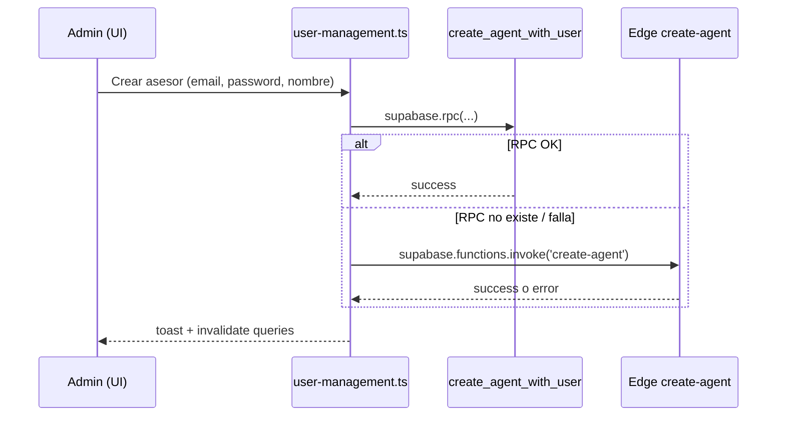

# Provisioning de asesores (rol `Agent`)

Guía para habilitar la creación de asesores desde **User Management** (`/users`) en el CRM, usando la misma infraestructura que las afiliadoras.

## Resumen

| Pieza | Ubicación | Propósito |
|-------|-----------|-----------|
| UI Admin | `src/routes/users.tsx` | Listar y crear asesores |
| Cliente API | `src/lib/user-management.ts` | `createAgentWithUser()` |
| RPC (recomendado) | `create_agent_with_user` | Mismo patrón que `create_affiliate_with_user` |
| Edge Function (respaldo) | `supabase/functions/create-agent/` | Si el RPC no existe aún |
| SQL de referencia | `supabase/migrations/20260601130000_create_agent_with_user.sql` | Definición del RPC |

## Flujo en el frontend



El frontend intenta **primero el RPC** y, si falla, invoca la **Edge Function** `create-agent`.

## Contrato del RPC `create_agent_with_user`

### Parámetros

| Parámetro | Tipo | Obligatorio | Descripción |
|-----------|------|-------------|-------------|
| `user_email` | `text` | Sí | Correo de acceso |
| `user_password` | `text` | Sí | Contraseña temporal (mín. 8 caracteres) |
| `user_first_name` | `text` | Sí | Nombre del asesor |
| `user_last_name` | `text` | No | Apellido |

### Reglas de negocio

- Solo un usuario con `profiles.role = 'Admin'` puede ejecutar la función.
- El perfil creado queda con `profiles.role = 'Agent'`.
- Se llama a `fix_user_tokens(target_user_id)` (igual que afiliadoras).
- El email debe ser único en `auth.users`.

### Comparación con afiliadoras

| | Afiliadoras | Asesores |
|---|-------------|----------|
| RPC | `create_affiliate_with_user` | `create_agent_with_user` |
| Rol en `profiles` | `Affiliate` | `Agent` |
| Tabla extra | `affiliates` + `affiliate_name` | — |
| UI | `/affiliates` | `/users` |
| Parámetro empresa | `company_name` | — |

Si ya tienes `create_affiliate_with_user` en Supabase, puedes abrir su definición en el Dashboard y duplicar la lógica cambiando el rol a `Agent` y omitiendo la inserción en `affiliates`.

## Cómo aplicar el RPC

### Opción A — Supabase CLI (recomendado)

```bash
# Desde la raíz del proyecto
supabase link --project-ref <TU_PROJECT_REF>
supabase db push
```

Esto aplica `supabase/migrations/20260601130000_create_agent_with_user.sql`.

### Opción B — SQL Editor (Dashboard)

1. Abre [Supabase Dashboard](https://supabase.com/dashboard) → tu proyecto → **SQL Editor**.
2. Copia el contenido de `supabase/migrations/20260601130000_create_agent_with_user.sql`.
3. Ejecuta el script.
4. En **Database → Functions**, verifica que aparece `create_agent_with_user`.

### Opción C — Solo Edge Function (sin RPC)

Si prefieres no crear el RPC todavía:

```bash
supabase functions deploy create-agent
```

La UI seguirá funcionando vía `supabase.functions.invoke('create-agent')` cuando el RPC devuelva error (p. ej. `PGRST202` = función no encontrada).

Variables requeridas en la función (automáticas en Supabase):

- `SUPABASE_URL`
- `SUPABASE_SERVICE_ROLE_KEY`
- `SUPABASE_ANON_KEY`

## Verificación manual

### 1. Probar el RPC en SQL Editor

```sql
-- Inicia sesión en el CRM como Admin antes, o usa el SQL Editor con rol service (solo staging)
SELECT public.create_agent_with_user(
  'asesor.prueba@example.com',
  'Temporal123!',
  'Ana',
  'Prueba'
);
```

### 2. Comprobar perfil

```sql
SELECT id, email, first_name, last_name, role
FROM public.profiles
WHERE email = 'asesor.prueba@example.com';
```

Debe mostrar `role = 'Agent'`.

### 3. Probar desde la app

1. Login como **Admin**.
2. Ir a **User Management** (`/users`).
3. **Agregar Asesor** → completar formulario → **Crear asesor**.
4. El nuevo usuario debe poder iniciar sesión con el email y contraseña temporal.

## Dependencias previas

Estas piezas deben existir en el proyecto Supabase (ya usadas por afiliadoras):

| Dependencia | Uso |
|-------------|-----|
| Tabla `public.profiles` | Rol y datos del asesor |
| Función `public.fix_user_tokens(uuid)` | Parche post-creación Auth |
| Trigger/handler en `auth.users` (opcional) | Puede crear `profiles` al insertar usuario |

Si `fix_user_tokens` no existe, créala o copia la misma que usa `create_affiliate_with_user` antes de desplegar este RPC.

## Asignación de clientes a asesores

Tras crear asesores, el Admin/Manager asigna clientes en el detalle (`/clients/:id`):

- Campo **Owner (Asesor)** → `UPDATE clients SET owner_id = <uuid_agente>`.
- Implementación: `updateClientOwner()` en `src/lib/secure-clients.ts`.
- Listado de opciones: `fetchAgentsForOwnerSelect()` en `src/lib/user-management.ts` (solo `role = 'Agent'`).

## RLS y vista Agent

Los asesores solo ven filas permitidas por RLS en `secure_clients` (`owner_id = auth.uid()`). La UI oculta columnas sensibles y acciones de administración en `src/routes/clients.index.tsx`.

## Solución de problemas

| Síntoma | Causa probable | Acción |
|---------|----------------|--------|
| `function create_agent_with_user does not exist` | RPC no aplicado | `supabase db push` o desplegar Edge `create-agent` |
| `Solo administradores pueden crear asesores` | Usuario no es Admin | Usar cuenta con `profiles.role = 'Admin'` |
| `Error al parchar tokens` | Falta `fix_user_tokens` | Revisar función usada por afiliadoras |
| Perfil con rol incorrecto | Trigger sobrescribe rol | Ajustar trigger `handle_new_user` o el `ON CONFLICT` del RPC |
| `extensions.crypt` no existe | Extensión `pgcrypto` | `CREATE EXTENSION IF NOT EXISTS pgcrypto WITH SCHEMA extensions;` |

## Archivos relacionados en el repo

```
supabase/
  migrations/20260601130000_create_agent_with_user.sql
  functions/create-agent/index.ts
  docs/provisioning-asesores.md          ← este archivo

src/
  lib/user-management.ts
  routes/users.tsx
```

## Seguridad

- No expongas `SUPABASE_SERVICE_ROLE_KEY` en el frontend.
- El RPC es `SECURITY DEFINER`: solo debe validar que `auth.uid()` sea Admin.
- Usa contraseñas temporales fuertes y obliga al asesor a cambiarlas en producción si tu flujo lo permite.
